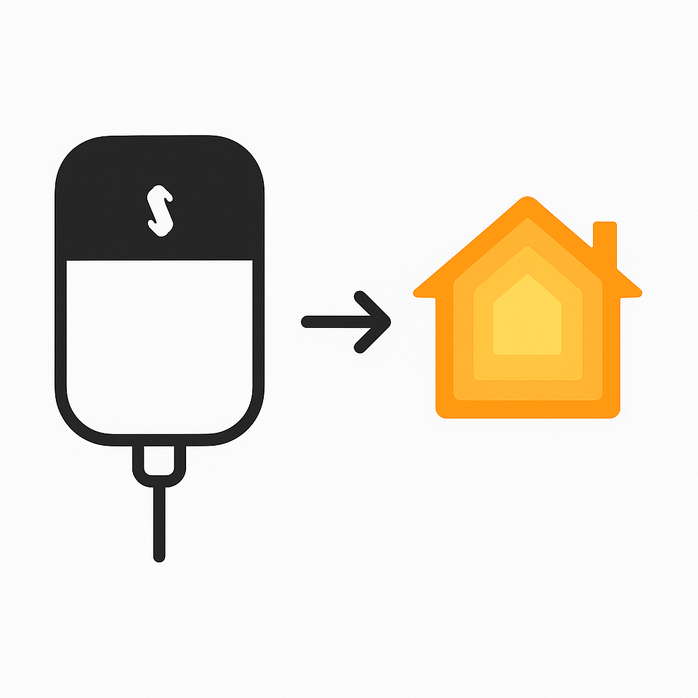

# Homebridge Sensibo Custom Plugin

<div align="center">
  
</div>

A custom Homebridge plugin to control Sensibo air conditioning devices through Apple HomeKit. This plugin allows you to control your Sensibo devices using Siri, the Home app, and other HomeKit-compatible applications.

## Acknowledgments

This plugin was inspired by and builds upon the excellent work of the [homebridge-sensibo-ac](https://github.com/nitaybz/homebridge-sensibo-ac) plugin.

**Key differences from the original plugin:**
- Simplified configuration for specific use cases
- Custom polling and error handling optimizations
- More logging and debugging capabilities

## ⚠️ Important: Local Network Deployment Required

**This plugin must run on your local network** (same WiFi as your iPhone/iPad) for HomeKit pairing to work. HomeKit uses mDNS discovery which only works on local networks.

**Recommended Setup: Raspberry Pi** - The most popular and reliable way to run Homebridge 24/7.

## Features

- **Multiple Device Support**: Control multiple Sensibo devices from a single plugin
- **Full HomeKit Integration**: Each device appears as a separate accessory in HomeKit
- **Thermostat Control**: Set target temperature, switch between heating/cooling modes
- **Humidity Monitoring**: View current humidity levels from your Sensibo devices
- **Real-time Updates**: Automatic polling for device state changes
- **Local Network Operation**: Runs reliably on your home network

## Requirements

- **Raspberry Pi** (recommended) or always-on computer on your local network
- Node.js 18.15.0 or higher (Node.js 22 recommended)
- Homebridge 1.3.0 or higher
- Sensibo API key (get yours from [Sensibo Developer Portal](https://home.sensibo.com/me/api))
- Active Sensibo devices connected to your account

## Installation

### Prerequisites

- Node.js 18.15.0 or higher
- Homebridge 1.3.0 or higher
- Sensibo API key (get yours from [https://home.sensibo.com/me/api](https://home.sensibo.com/me/api))

### Local Installation

1. Install Homebridge globally:
```bash
npm install -g homebridge
```

2. Clone this repository:
```bash
git clone https://github.com/yourusername/homebridge-sensibo-custom.git
cd homebridge-sensibo-custom
```

3. Install dependencies:
```bash
npm install
```

4. Link the plugin for development:
```bash
npm link
```

### Configuration

1. Copy the example configuration:
```bash
cp config.json.example ~/.homebridge/config.json
```

2. Edit the configuration file and add your Sensibo API key:
```json
{
  "platforms": [
    {
      "platform": "SensiboCustom",
      "name": "Sensibo Custom",
      "apiKey": "YOUR_SENSIBO_API_KEY",
      "pollingInterval": 30000,
      "debug": false
    }
  ]
}
```

### Configuration Options

- `apiKey` (required): Your Sensibo API key from the developer portal
- `pollingInterval` (optional): Device status check interval in milliseconds (default: 30000)
- `debug` (optional): Enable detailed logging (default: false)

## Usage

### Running Locally

Start Homebridge in debug mode:
```bash
homebridge -D
```

Or use the npm script:
```bash
npm start
```

### Adding to HomeKit

1. Open the Apple Home app on your iOS device
2. Tap the "+" button and select "Add Accessory"
3. Scan the QR code displayed in the Homebridge logs
4. Your Sensibo devices will appear as separate accessories

### HomeKit Pairing

### Step 5: Pair with HomeKit

1. **Start Homebridge**:
   ```bash
   # Start Homebridge (will run in foreground)
   homebridge
   
   # Or start as a service (recommended)
   sudo systemctl enable homebridge
   sudo systemctl start homebridge
   ```

2. **Find the QR Code**: Look in the Homebridge logs for a QR code and PIN

3. **Scan with iPhone**: 
   - Open the Home app on your iPhone/iPad
   - Tap the "+" button
   - Select "Add Accessory"
   - Scan the QR code from the logs
   - Enter the PIN if prompted

4. **Your Sensibo devices will appear** as separate accessories in HomeKit!

### Troubleshooting Pairing

- **"Accessory Not Found"**: Make sure your iPhone and Raspberry Pi are on the same WiFi network
- **QR Code Not Working**: Try entering the PIN manually in the Home app
- **No Devices Found**: Check your Sensibo API key and internet connection

## Local Development & Testing

### Testing Your Setup

1. **Clone this repository**:
   ```bash
   git clone https://github.com/yourusername/homebridge-sensibo-custom.git
   cd homebridge-sensibo-custom
   ```

2. **Install dependencies**:
   ```bash
   npm install
   ```

3. **Create `.env` file**:
   ```bash
   echo "SENSIBO_API_KEY=your_api_key_here" > .env
   ```

4. **Test the plugin**:
   ```bash
   npm test
   ```

5. **Run local HomeKit test**:
   ```bash
   node test-homekit.js
   ```

## Supported Devices

- Sensibo Sky
- Sensibo Air
- Sensibo Air Pro
- Any Sensibo device that supports the v2 API

## Supported HomeKit Services

- **Thermostat**: Temperature control and AC mode switching
- **Humidity Sensor**: Current humidity readings
- **Accessory Information**: Device details and firmware version

## Troubleshooting

### Common Issues

1. **"API Key is required" error**
   - Make sure you've added your API key to the configuration
   - Verify the API key is correct at [https://home.sensibo.com/me/api](https://home.sensibo.com/me/api)

2. **Devices not appearing in HomeKit**
   - Check the Homebridge logs for errors
   - Ensure your Sensibo devices are online and connected to WiFi
   - Try restarting Homebridge

3. **Commands not working**
   - Verify your API key has the necessary permissions
   - Check if the Sensibo app can control the devices
   - Enable debug logging to see detailed API responses

### Debug Logging

Enable debug logging in your configuration:
```json
{
  "platforms": [
    {
      "platform": "SensiboCustom",
      "debug": true
    }
  ]
}
```

Or set the environment variable:
```bash
export DEBUG=true
```

## API Rate Limits

The Sensibo API has rate limits. This plugin:
- Uses gzip compression to increase rate limits
- Polls devices every 30 seconds by default (configurable)
- Batches API calls when possible

## Contributing

1. Fork the repository
2. Create a feature branch
3. Make your changes
4. Test thoroughly
5. Submit a pull request

## Related Projects

- [homebridge-sensibo-ac](https://github.com/nitaybz/homebridge-sensibo-ac) - The original and more feature-rich Sensibo plugin
- [Homebridge](https://homebridge.io/) - The bridge that enables HomeKit support for non-HomeKit devices
- [Sensibo API](https://sensibo.github.io/) - Official Sensibo API documentation

## Support

If you encounter issues:
1. Check the [Homebridge logs](https://github.com/homebridge/homebridge/wiki/Troubleshooting) for error messages
2. Verify your Sensibo API key and device connectivity
3. Consider trying the original [homebridge-sensibo-ac](https://github.com/nitaybz/homebridge-sensibo-ac) plugin if you need more advanced features

## License

This project is licensed under the GNU Affero General Public License v3.0 (AGPL-3.0).

See the [LICENSE](LICENSE) file for details.
